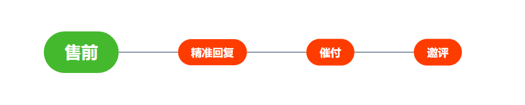
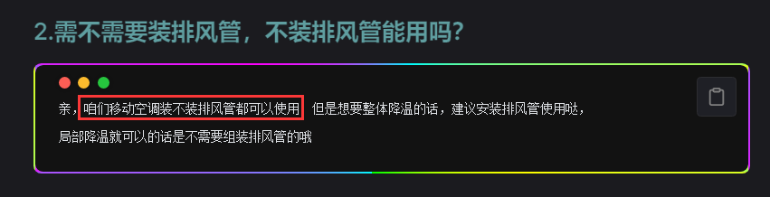
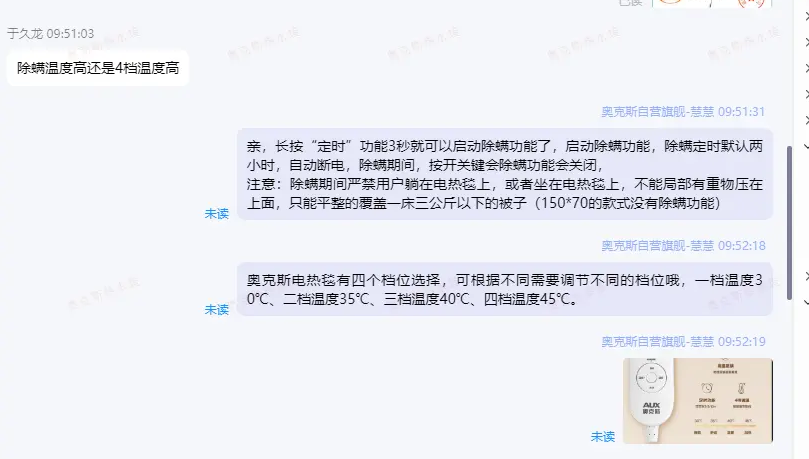

# 售前核心 > 将产品卖出去

## 如何把东西卖出去？

现在让我们对客户行为进行分析,当我们为顾客的时候,`我们希望得到什么样的服务` ？

1.  我们在进店寻找客服咨询的时候,必然是有疑问需要咨询的,例如我希望得到、功率、尺寸、等信息

    - 我希望我的疑问能够，得到快速精准的被解答 -----> <font title="red">精准回复</font>

2.  我们希望所咨询的产品更加的优惠

    - 我们想要优惠的价格 ---> <font title="red">让利</font>

3.  我们迫切的需要这个产品，我希望能更快获得产品。

    - 最好今天或者明天能到 ---> <font title="red">优先发货</font> `最好发顺丰、京东`

4.  我们希望有好的售后服务，足够长的质保，产品质量好

    - 产品有质量问题自己不会产生损失 ---> <font title="red">质保</font> `有质量保障能换新`

5.  我们希望客服足够的专业，能够迅速的回复问题，并且耐心热情

    - 更快的回复和耐心

```c#
通过以上的分析,我们可以初步得到一些信息，现在让我们来总结一下
1.顾客在进线咨询的时候，通常会对产品相关的问题有一些疑问，需要得到明确的解答
2.顾客希望能够以更优惠的价格，获得更好的服务，这些一般体现在，质保、快递、回复效率以及服务态度
```

---

## 售前流程

> 通过以上的分析，我们清楚了顾客的基础想法

那么现在，我们来根据这些情况，制定一些流程来`解决这些问题`



## 流程解刨

### **1.** 什么叫精准回复？

下图中,顾客询问的问题，得到了精准的回复，以及建议，属于精准回复的正确案例


---

下图中,顾客询问的问题，并未正面回复，短语并不适用,顾客的疑虑并未得到有效回复，视为未精准回复的反面案例


#### 在遇到上述情况时,我们可以明确告知顾客答案:除螨的温度高、再配合短语介绍一下 4 个档的温度

```c#
1.亲，除螨的温度更高呢，大概在50度左右
2.奥克斯电热毯有四个档位可以选择，可根据需要选择不同的档位
一档温度30℃、二档温度35℃、三档温度40℃、四档温度45℃。
```

---

### **2.** 什么是催付？

#### 上面通过对精准回复的了解，我们解决了顾客的疑问，那么接下来我们需要解决顾客其他的顾虑

在顾客的提问解决以后，我们需要主动向顾客推送一些重要的信息，来引导顾客下单.
催付的结构一般为：
`卖点、优惠、保价、运费险、质保、主动挖掘、等....`

以移动空调为例：

::: code-group

```c# [卖点]
亲，咱们实测出风口制冷温度，大2p可以达到8度左右，1.5p可以达到10度左右，1p可以达到15度左右，
效果非常好哒，喜欢可以拍下哦
```

```c# [优惠]
亲亲,我们限时活动冲销量喔，现在下单给您申请最大福利 1.5P（2P）嗮图一起帮您优惠 120 元哦
```

```c# [保价]
任何平台比我们便宜，有截图，我们全部在它的基础上再优惠 20
咱们家就是最优惠的价格，可以放心下单，无忧购买
```

```c# [运费险]
亲可以放心购买试试看哈，我们有赠送大额运费 险，收到货不合适不满意支持七天无理由退换货的，
来回运费我们承担的哦，好的产品质量才敢如此保证的呢
```

```c# [质保]
我们支持全国联保，1 年换新，365 天整机质保，保障期内质量问题来回运费，维修费用全包，
售后无忧，放心购买喔！~

```

```c# [主动挖掘]
亲,您还有什么疑问或者顾虑吗？或者您对产品有什么需求和想法都可以告诉客服这边随时为您解答呢！
```

```c# [试一试]
亲亲，我们是支持7天无理由退换，如果收到不满意、不喜欢、不想要都可以退换，
可以买回去体验一下呢，相信您会满意的喔！
```

:::

---

### **3.** 什么时候进行催付？

当顾客在使用手机进行搜索商品时，往往会咨询很多的客服，询问多款候选产品进行对比咨询
所以顾客在提问后，在店铺的停留时间，`一般不会超过 30 秒`

顾客同时咨询多家店铺，多个客服，为什么在你这里下单购买？ `Why is it you`

```c#
1.因为们能够专业精准回复顾客的问题
2.因为我们足够优惠支持全网比价
3.我们有超长的质保可以换新，且质量问题运费我们承担
4.我们有运费险，减少购物风险
5.我们热情主动、挖掘顾客的顾虑
```

> # 所以：请顾客进店 30 秒内，完成 精准回复+催付推送
