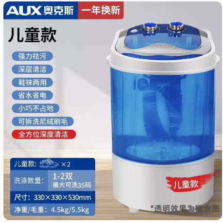

# 奥克斯洗鞋机参数-儿童款

## 产品图片



## 儿童款基本参数

```c# :line-numbers
【型号】：奥克斯洗鞋机 XPB20-608
【功率】:200W
【净重】:5KG
【毛重】:6KG
【功能】半自动洗涤
【内桶深】:26cm
【排水管】:长度:34cm 直径:1.5-2 cm
【进水管】:长度:118CM 口径:1.5CM
【洗涤容量】:2KG
【洗涤数量】1-2 双（最大可洗 40 码）
【产品尺寸】:33*33*53cm
【包装尺寸】:36*36* 56cm
【进水方式】手动进水管接水，或倒水入内
【排水方式】排水管放下即可排水
【洗涤时间】:15 分钟 1 次(可多次洗涤)
【安装方法】:无需安装，通电即用
```
