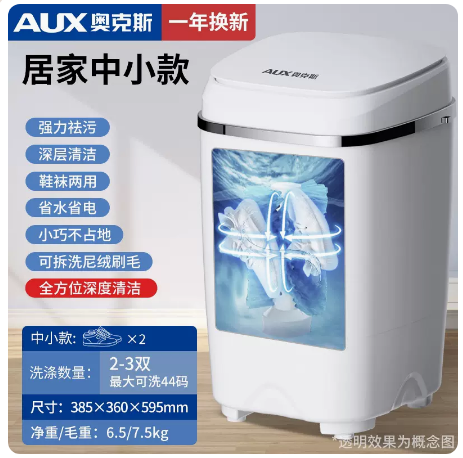

# 奥克斯洗鞋机参数-居家中小款

## 产品图片



## 居家中小款基本参数

```c#
【型号】：奥克斯洗鞋机XPB28-608
【功率】:200W
【净重】:6.5KG
【毛重】:7.5KG
【功能】半自动洗涤
【内桶深】:35cm
【洗涤容量】:3.2KG
【洗涤数量】：2-3双（最大可洗44码）
【产品尺寸】:38.5*36*59.5cm
【包装尺寸】:41*41.5*64cm
【进水管】:长度:118CM   口径:1.5CM
【进水方式】手动进水管接水，或倒水入内
【排水管】:长度:50cm     直径:1.5-2 cm
【排水方式】排水管放下即可排水
【洗涤时间】:15分钟1次(可多次洗涤)
【安装方法】:无需安装，通电即用
```
