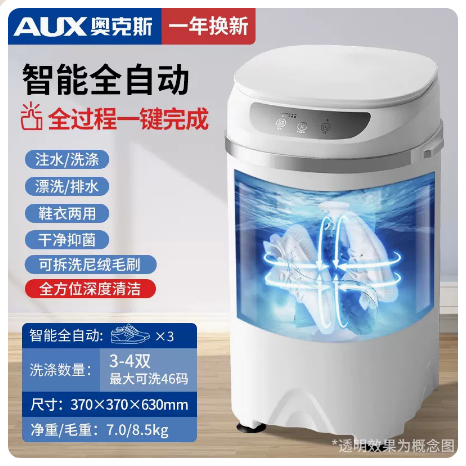

## 智能全自动基础参数

## 产品图片



```C#
【型号】：奥克斯洗鞋机XPB30-508（不带烘干）
【功率】:洗涤220W
【线长】：130cm
【净重】:7KG
【毛重】:8.5KG
【功能】全自动洗涤
【进水管】:长度:115CM   口径:1.5CM
【内桶深】:33cm
【洗涤容量】:3KG
【洗涤数量】：3-4双（最大可洗45码）
【产品尺寸】:37*37*63cm
【包装尺寸】:43*43*70cm
【进水方式】手动进水管接水，或倒水入内
【排水管】:长度:45cm     直径:1.5-2 cm
【排水方式】程序自动排水
【洗涤时间】:15分钟1次(可多次洗涤)
【安装方法】:接上进水管，插电即用
```
