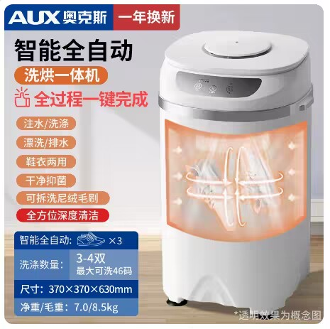
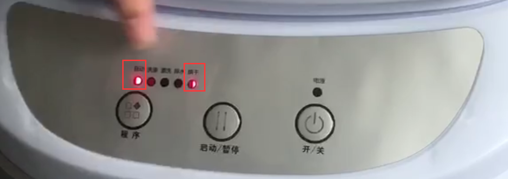
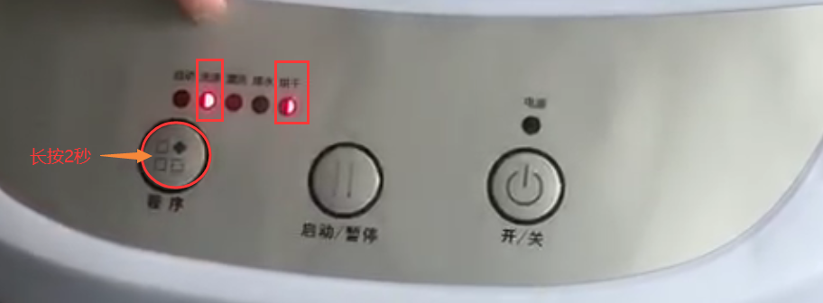

## 产品图片



## 智能全自动热烘干基础参数

```c#
【型号】：奥克斯洗鞋机XPB30-508（热烘干）
【功率】:洗涤:220W，烘干:500W
【线长】：130cm
【净重】:7KG
【毛重】:8.5KG
【功能】全自动洗涤，烘干
【内桶深】:33cm
【洗涤容量】:3KG
【洗涤数量】：3-4双（最大可洗46码）
【产品尺寸】:37*37*63cm
【包装尺寸】:43*43*70cm
【进水管】:长度:115CM   口径:1.5CM
【进水方式】手动进水管接水，或倒水入内
【排水管】:长度:45cm     直径:1.5-2 cm
【排水方式】程序自动排水
【洗涤时间】:全自动约60分钟
【安装方法】:接上进水管，插电即用

```

## 【烘干操作方法】

1. 按到烘干模式后:面板 1 灯和 5 灯会同时亮起【此为烘干 4 小时】如下图:
   

2. 再长按程序键 2 秒:面板 2 灯和 5 灯会同时亮起【此为烘干 6 小时】如下图:
   
3. 再长按程序键 2 秒:面板 3 灯和 5 灯会同时亮起【此为烘干 8 小时】
