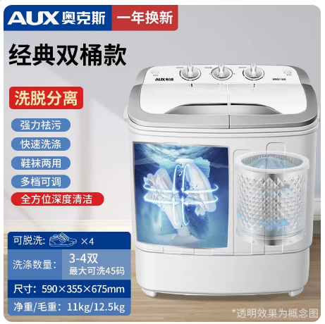

# 奥克斯洗鞋机参数-经典双桶款

## 产品图片



## 经典双桶款基本参数

```c#
【型号】：奥克斯洗鞋机XPB30-1288s
【功率】:洗涤200W，脱水120W
【线长】：140cm
【净重】:11KG
【毛重】:12.5KG
【功能】半自动洗涤,半自动脱水
【内桶深】:32cm
【脱水容量】:1KG（38码以下的鞋）
【洗涤容量】:3.8KG
【洗涤数量】：3-4双（最大可洗45码）
【产品尺寸】:41*42*69cm
【包装尺寸】:44*44*73cm
【进水管】:长度:118CM   口径:1.5CM
【进水方式】手动进水管接水，或倒水入内
【排水管】:长度:45cm     直径:1.5-2 cm
【排水方式】放下排水管，旋钮拧到排水
【洗涤时间】:15分钟1次(可多次洗涤)
【安装方法】:无需安装，通电即用
```
