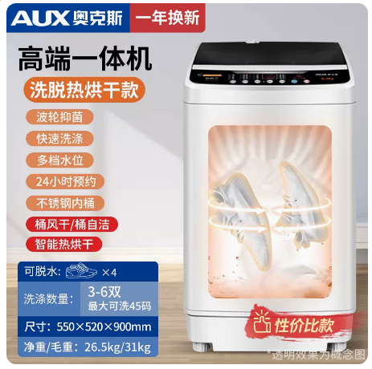
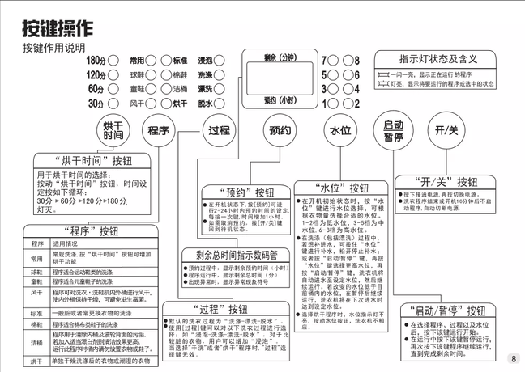

# 高端一体机

## 产品图片



## 洗脱烘高端一体机基本参数

```c# :line-numbers
【型号】：XQB75-A1658R（透明黑）
【功率】:  325W
【线长】：130cm
【净重】: 26.5KG
【毛重】: 31KG
【功能】全自动洗涤，脱水，烘干
【内桶深】:33cm
【洗涤容量】:7.5KG
【洗涤数量】：3-5双（最大可洗45码）
【产品尺寸】:55*52*90cm
【进水管】:长度:105CM   口径:1.5CM
【进水方式】手动进水管接水，或倒水入内
【排水管】:长度:70cm     直径:1.5-2 cm
【排水方式】程序自动排水
【洗涤时间】:约45分钟
【安装方法】:接上进水管，插电即用
```

## 操作面板


