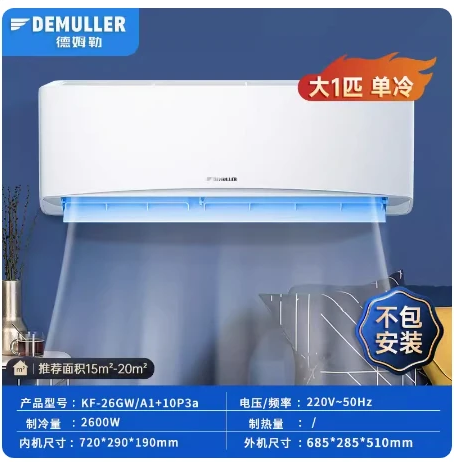
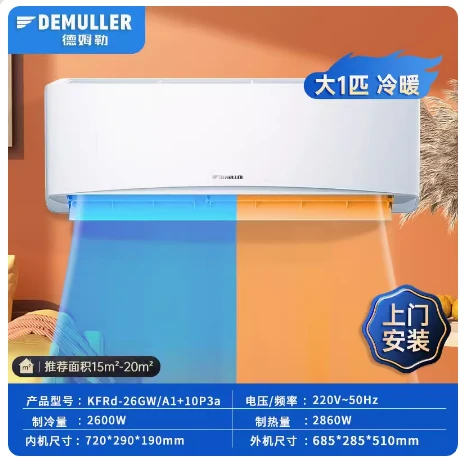

# 1 匹基础参数-德姆勒挂机空调

## 1 匹产品参数

:::code-group

```c# [单冷定频]{1}
【整套型号】:德姆勒分体式空调KF-26GW/A1+10P3a大1匹单冷（整套）
【外机型号】:德姆勒挂壁式空调室外机KF-26W/10+10P3a 白色
【内机型号】:德姆勒挂壁式空调室内机KF-26G/A2+10P3a 白色
【重量】:内机8KG 、外机21KG
【功率】:700w
【制冷量】:2600w
【内机尺寸】:72*29*19cm
【外机尺寸】68.5*28.5*51cm
【电源线长】:1米
【适用面积】:0-20平方
【规格选项】:大1匹单冷不包安装、大1匹单冷包安装
【温度设置范围】:16-31度
【产品清单】:内机*1台、外机*1台、遥控器*1 电池*1对、高低压连接管*各1根、排水软管*1、包扎带*1卷、内机挂板*1块、穿墙护套*1个
```

```c# [冷暖定频]{1}
【整套型号】:德姆勒分体式空调KFRd-26GW/A1+10P3a大1匹冷暖（整套）
【外机型号】:德姆勒挂壁式空调室外机KFR-26W/10+10P3a 白色
【内机型号】:德姆勒挂壁式空调室内机KFRd-26G/A1+10P3a 白色
【重量】:内机8KG 、外机22Kg
【功率】:700w
【制冷量】:2600w
【制热量】:2860w
【内机尺寸】:72*29*19cm
【外机尺寸】68.5*28.5*51cm
【电源线长】:1米
【适用面积】:0-20平方
【规格选项】:大1匹冷暖不包安装、大1匹冷暖包安装
【温度设置范围】:16-31度
【产品清单】:内机*1台、外机*1台、遥控器*1 电池*1对、高低压连接管*各1根、排水软管*1、包扎带*1卷、内机挂板*1块、穿墙护套*1个
```

:::

## 1 匹单冷产品图片



## 1 匹冷暖产品图片


