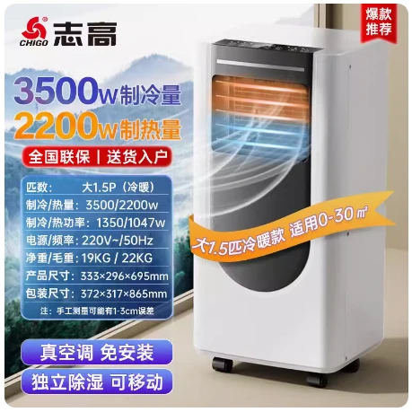

# 1.5 匹冷暖基础参数-志高移动空调

## 产品图片



## 产品参数

::: danger 请注意
标红区域与其他厂家不同
:::

::: code-group

```c# [万爱]{1}
【产品型号】:志高 -KY-7KR -黑白色-33107Ab（大1.5P冷暖）  黑白色
【重量】:19KG
【功率】:1350w
【制冷量】:3500w
【制热量】:3200w
【产品尺寸】:33.3*29.6*69.5cm
【电源线长】:1.5米
【几块档板】:2块
【适用面积】:0-30平方
【规格选项】:1.5匹冷暖、大1.5匹冷暖
【温度设置范围】:16-30度
【产品清单】:机器*1台、排风管*1根、档板*1套、排水管*1根、遥控器*1件、接头配件*2个、说明书*1
```

```c# [富达]{1}
【产品型号】:志高移动空调KY-ZR32D（FD）
【重量】:20.5KG  // [!code error]
【功率】:920w  // [!code error]
【制冷量】:3200w // [!code error]
【制热量】:3150w // [!code error]
【产品尺寸】:33*28*70.4cm // [!code error]
【电源线长】:1.5米
【几块档板】:3块  // [!code error]
【适用面积】:0-30平方
【规格选项】:1.5匹冷暖、大1.5匹冷暖
【温度设置范围】:16-30度
【产品清单】:机器*1台、排风管*1根、档板*1套、排水管*1根、遥控器*1件、接头配件*2个、说明书*1
```

:::
