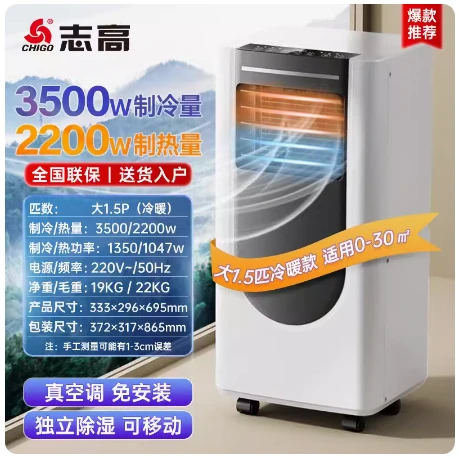

# 2 匹冷暖基础参数-志高移动空调

## 产品图片



## 产品参数

::: danger 请注意
标红区域与其他厂家不同
:::

::: code-group

```c# [宝士] {1}
【产品型号】:志高移动空调KYR-32/A013B（大2p冷暖）（bs）
【重量】:24KG
【功率】:1500W
【制冷量】:4200w
【制热量】:3000w
【产品尺寸】:35.5*33*80.7cm
【电源线长】:1.5米
【几块档板】:2块
【适用面积】:0-40平方
【规格选项】:2匹冷暖、大2匹冷暖
【温度设置范围】:16-30度
【产品清单】:机器*1台、排风管*1根、档板*1套、排水管*1根、遥控器*1件、接头配件*2个、说明书*1
```

```c# [万爱]{1}
【产品型号】:志高 -ZGR-40-白色-33209Ac（大2P冷暖）  白色
【重量】:27KG  // [!code error]
【功率】:1800W  // [!code error]
【制冷量】:4000w  // [!code error]
【制热量】:3600w  // [!code error]
【产品尺寸】:36.1*32*81cm  // [!code error]
【电源线长】:1.5米
【几块档板】:2块
【适用面积】:0-40平方
【规格选项】:2匹冷暖、大2匹冷暖
【温度设置范围】:16-30度
【产品清单】:机器*1台、排风管*1根、档板*1套、排水管*1根、遥控器*1件、接头配件*2个、说明书*1
```

```c# [富达]{1}
【产品型号】:志高移动空调KY-Z36F（FD）
【重量】:20KG // [!code error]
【功率】:960W // [!code error]
【制冷量】:4000w // [!code error]
【制热量】:3950w // [!code error]
【产品尺寸】:36.1*32*81cm // [!code error]
【电源线长】:1.5米
【几块档板】:3块 // [!code error]
【适用面积】:0-40平方
【规格选项】:2匹冷暖、大2匹冷暖
【温度设置范围】:16-30度
【产品清单】:机器*1台、排风管*1根、档板*1套、排水管*1根、遥控器*1件、接头配件*2个、说明书*1
```

:::
