# 配件大全

## 1.1 空调接头(内件)

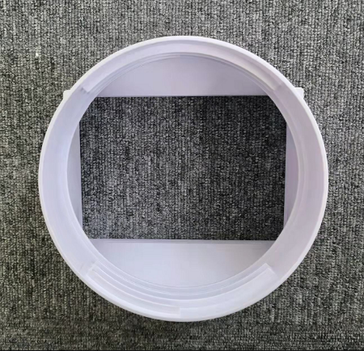

> 内件：`装在空调后面的`

::: code-group

```c# [补发格式]
[此配件登记时: 需让客户 --> 提供铭牌 --> 核实厂家]  // [!code error]
[根据不同的厂家: 登记 --> 不同的配件名称]  // [!code error]
补发格式："按厂家选其一"
万爱：空调端接口*1
富达：方接圆*1
夏宝：内接头*1
宝士：风管入口*1
```

:::

## 1.2 空调接头(外件)

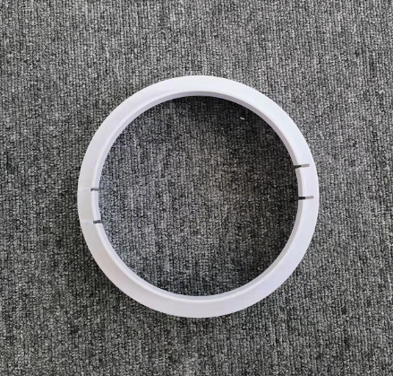

> 外件：`装在挡板上面的`

::: code-group

```c# [补发格式]
[此配件登记时需让客户 --> 提供铭牌 --> 核实厂家]// [!code error]
[根据不同的厂家登记 --> 不同的配件名称]  // [!code error]
补发格式："按厂家选其一"
万爱：窗口端接口*1
富达：扁接圆*1
夏宝：外接头*1
宝士：风管缩口*1
```

:::

## 2.排风管

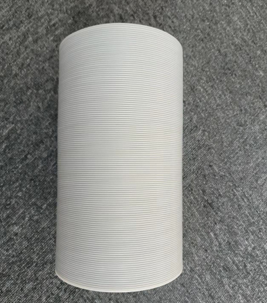

> 所有厂家通称排风管无其他名称:`注意我们的排风管左旋的`。

::: code-group

```c# [补发格式]
排风管*1
```

```c# [配件信息]
最大长度：≈ 150cm
最大直径：≈ 15cm
单卖售价：30/根
```

:::

## 3.排水管

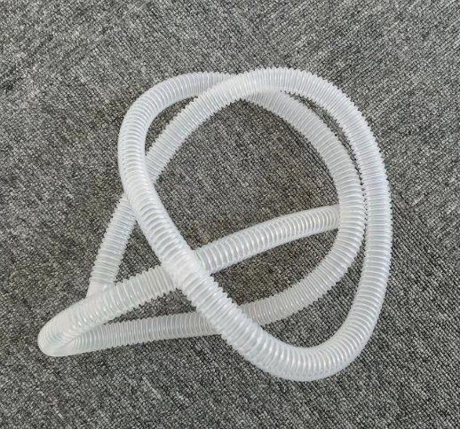

::: code-group

```c# [登记格式]
排水管*1
```

```c# [配件信息]
尺寸：≈ 104 * φ 1.5cm
```

:::

## 4.挡板

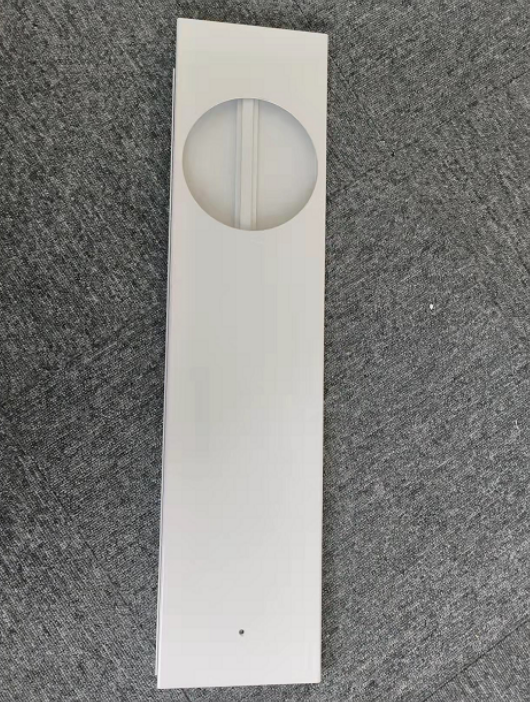

::: code-group

```c# [补发格式]
挡板一套*1
```

```c# [配件信息]
短板尺寸: ≈ 61.5*16cm
长板尺寸(带风管孔): ≈ 67.5*16cm
挡板拼接最大长度：≈ 123cm
单卖售价：30/套
```

:::

## 5.止水塞

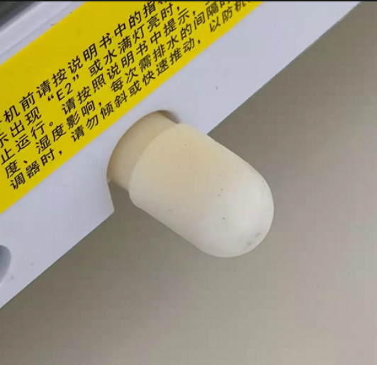
::: code-group

```c# [补发格式]
止水塞*1
```

:::

## 6.遥控器

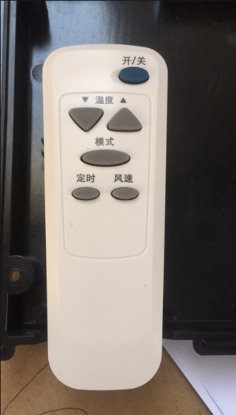

> `图片仅供参考，遥控器有很多种，不一定是图上这种`

::: code-group

```c# [补发格式]
遥控器*1
```

:::

## 7.滤网

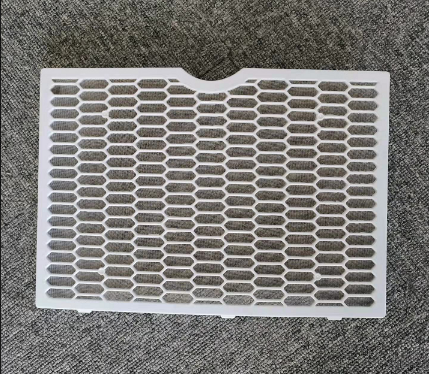
::: code-group

```c# [补发格式]
滤网*1
```

:::

## 8.横摆叶

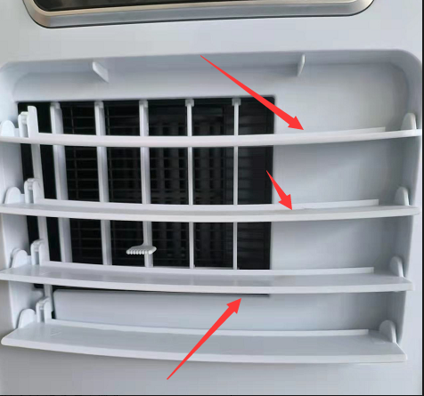
::: code-group

```c# [补发格式]
横摆叶*1
```

:::

## 9.竖摆叶

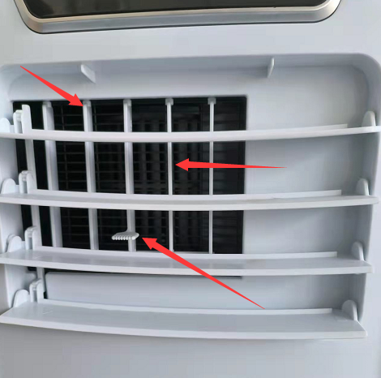
::: code-group

```c# [补发格式]
竖摆叶*1
```

:::

## 10.摆叶连杆

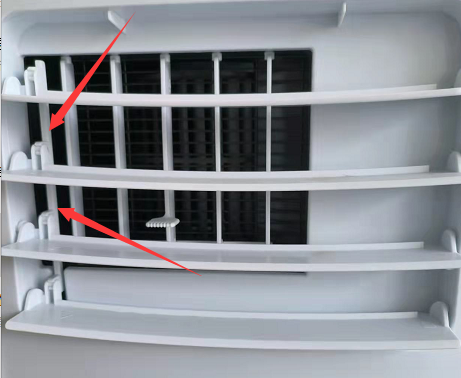
::: code-group

```c# [补发格式]
摆叶连杆*1
```

:::

## 11.万向轮

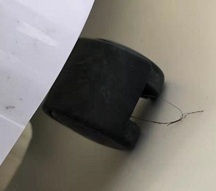
::: code-group

```c# [补发格式]
万向轮*1
```

:::
