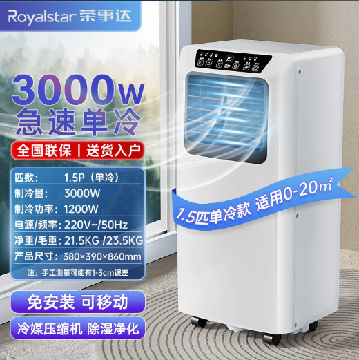
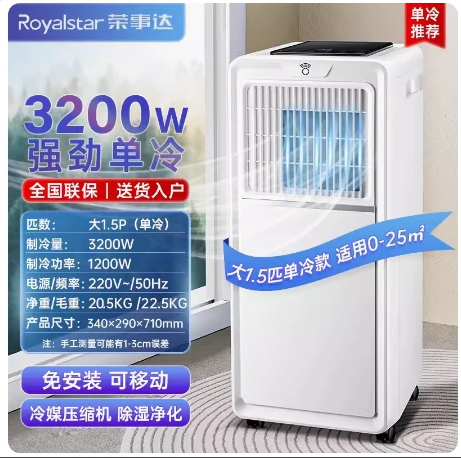

# 1.5 匹基础参数-荣事达移动空调

## 1.5 匹单冷产品参数

::: danger 请注意
标红区域与其他厂家不同
:::

::: code-group

```c# [宝士] {1}
【产品型号】:荣事达移动空调KY-23/A007C1（1.5P单冷）（bs）
【重量】:18KG
【功率】:1000w
【制冷量】:3000w
【产品尺寸】:33*28*68cm
【电源线长】:1.5米
【几块档板】:2块
【适用面积】:0-25平方
【规格选项】:1.5匹、大1.5匹
【温度设置范围】:16-30度
【产品清单】:机器*1台、排风管*1根、档板*1套、排水管*1根、遥控器*1件、接头配件*2个、说明书*1
```

```c# [夏康]{1}
【产品型号】:荣事达移动空调KY-35D（XK）
【重量】:22KG  // [!code error]
【功率】:1200w // [!code error]
【制冷量】:3200w  // [!code error]
【产品尺寸】:30*31.5*69cm // [!code error]
【电源线长】:1.5米
【几块档板】:2块
【适用面积】:0-25平方
【规格选项】:1.5匹、大1.5匹
【温度设置范围】:16-30度
【产品清单】:机器*1台、排风管*1根、档板*1套、排水管*1根、遥控器*1件、接头配件*2个、说明书*1
```

:::

## 1.5 匹单冷**宝士**产品图片



## 1.5 匹单冷**夏康**产品图片


