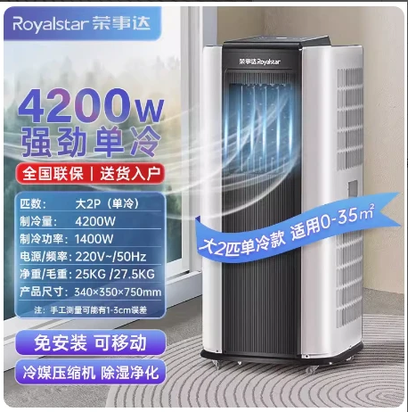
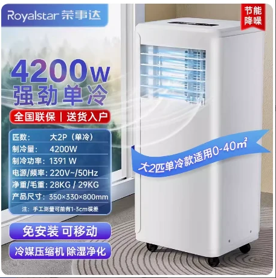

# 2 匹单冷基础参数-荣事达移动空调

## 产品参数

::: danger 请注意
标红区域与其他厂家不同
:::

::: code-group

```c# [宝士] {1}
【产品型号】:荣事达移动空调KY-32/A013B（大2p单冷）（bs）
【重量】:24KG
【功率】:1500W
【制冷量】:4200w
【产品尺寸】:35.5*33*80.7cm
【电源线长】:1.5米
【几块档板】:2块
【适用面积】:0-35平方
【规格选项】:2匹、大2匹
【温度设置范围】:16-30度
【产品清单】:机器*1台、排风管*1根、档板*1套、排水管*1根、遥控器*1件、接头配件*2个、说明书*1
```

```c# [夏康] {1}
【产品型号】:荣事达移动空调KY-36A（XK）
【重量】:25KG  // [!code error]
【功率】:1400W  // [!code error]
【制冷量】:4200w
【产品尺寸】:34.5*35.5*75.2cm  // [!code error]
【电源线长】:1.5米
【几块档板】:2块
【适用面积】:0-35平方
【规格选项】:2匹、大2匹
【温度设置范围】:16-30度
【产品清单】:机器*1台、排风管*1根、档板*1套、排水管*1根、遥控器*1件、接头配件*2个、说明书*1
```

:::

## 2 匹单冷**夏康**产品图片



## 2 匹单冷**宝士**产品图片


