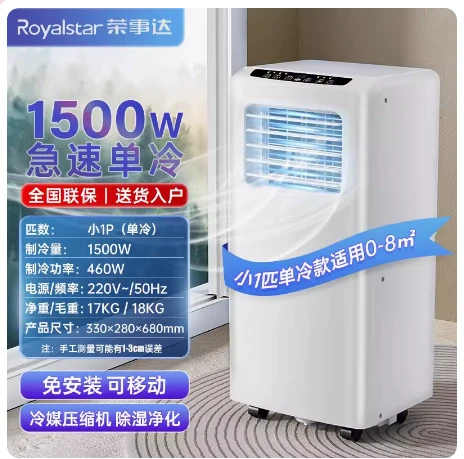

# 小 1 匹基础参数-荣事达移动空调

## 产品图片



## 产品参数

::: code-group

```c# [宝士] {1}
【产品型号】:荣事达移动空调KY-15/A007H1（小1P单冷）（bs）
【重量】:15KG
【功率】:460w
【制冷量】:1200w
【产品尺寸】:33*28*68cm
【电源线长】:1.5米
【几块档板】:2块
【适用面积】:0-8平方
【规格选项】:小1匹
【温度设置范围】:16-30度
【产品清单】:机器*1台、排风管*1根、档板*1套、排水管*1根、遥控器*1件、接头配件*2个、说明书*1
```

:::
